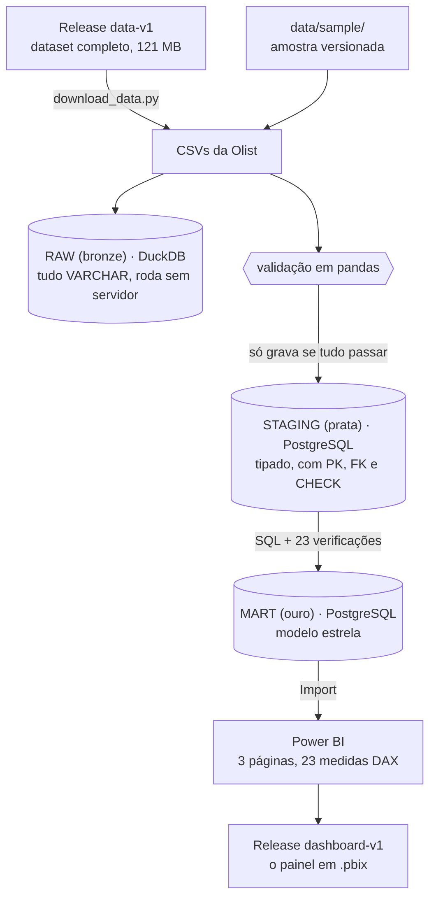

# Sales Intelligence Platform

Pipeline de dados sobre o **Olist Brazilian E-Commerce Dataset** — ~100 mil
pedidos reais de um marketplace brasileiro — do CSV bruto até um painel em
Power BI.

## Problema

Uma empresa de e-commerce possui dados de vendas distribuídos em diferentes
fontes e precisa de uma estrutura centralizada para analisar o desempenho:
quanto vende, o quê, para quem e em quanto tempo entrega.

## Arquitetura

Modelo **medallion**, em camadas:



RAW e STAGING leem os mesmos CSVs, lado a lado: a RAW não alimenta a STAGING.
Ela existe para o projeto rodar logo após o clone, sem instalar servidor.

- **RAW** guarda o dado como ele chegou, defeitos incluídos: eles são tratados
  adiante, não escondidos na entrada.
- **STAGING** valida em Python antes de gravar e garante com constraint no
  banco — o Python explica o erro, a constraint impede que ele entre.
- **MART** é um modelo estrela: 5 dimensões e a `fato_vendas`, uma linha por
  item vendido. A carga roda 23 verificações e desfaz tudo se uma falhar.
- **Power BI** importa a MART e herda as regras de negócio do SQL. Cada número
  do painel foi conferido contra ele.

**Estado atual:** as quatro camadas e o painel estão prontos, o repositório foi
reorganizado e a arquitetura está diagramada. Em andamento: os insights.

## O que os dados mostram

Recorte de jan/2017 a ago/2018: R$ 15,7 milhões em 97.905 pedidos.

- **Entrega atrasada destrói a avaliação.** A nota média cai de 4,29 no prazo
  para 1,70 com 8+ dias de atraso. As entregas atrasadas são 6,7% das
  avaliações e 36,7% das de 1 estrela.
- **O atraso é previsível.** O prazo prometido soma uma folga parecida em todo
  o país, e onde a entrega é longa ela vira pouca margem: nos 24 estados com
  volume, quanto menor a margem, maior o atraso (correlação −0,87). Os seis
  estados de menor margem são do Nordeste.
- **Quase toda venda é a primeira venda de alguém.** 96,7% dos pedidos; só
  3,03% dos clientes voltam. Por isso a receita que parou de crescer em 2018 é,
  na prática, aquisição que parou de crescer.

As seis conclusões, com o que eu faria a respeito de cada uma, estão em
[docs/insights.md](docs/insights.md).

## Começando

**Sem servidor** — só Python 3.11 ou mais novo (desenvolvido no 3.14). A
amostra de 3.000 pedidos já vem no repositório:

```bash
git clone https://github.com/albuquerques/sales-intelligence-platform.git
cd sales-intelligence-platform
pip install -r requirements.txt
python run.py raw --sample           # cria sales_intelligence.duckdb, schema raw
```

**Com PostgreSQL** — todas as camadas, no dataset completo. Exige um servidor
rodando e o `.env` configurado ([passo a passo](docs/pipeline.md#camada-staging--postgresql)):

```bash
python run.py tudo                   # baixa os dados, RAW, STAGING e MART, nesta ordem
```

Leva uns 2 minutos e para na primeira etapa que falhar. Cada camada também roda
sozinha: `python run.py raw`, `staging` ou `mart`.

**Só o painel** — [baixe o `sales_intelligence.pbix`](https://github.com/albuquerques/sales-intelligence-platform/releases/download/dashboard-v1/sales_intelligence.pbix)
(10 MB) e abra no Power BI Desktop. Os dados vêm dentro do arquivo; não precisa
de banco.

## Documentação

| Documento | O que tem |
|---|---|
| [insights.md](docs/insights.md) | as seis conclusões para o negócio, com recomendação e onde conferir |
| [pipeline.md](docs/pipeline.md) | RAW e STAGING: a amostra, a validação, as decisões de carga |
| [star_schema.md](docs/star_schema.md) | MART: o grão, as verificações e as perguntas de negócio em SQL |
| [dashboard.md](docs/dashboard.md) | Power BI: como abrir, as medidas e o que cada página mostra |
| [data_dictionary.md](docs/data_dictionary.md) | profiling de todas as colunas do dataset de origem |
| [er_diagram.md](docs/er_diagram.md) | diagrama ER do dataset de origem |

## Estrutura

```
data/
  sample/            amostra versionada (roda sem download)
  raw/               dataset completo (gitignored)
  manifest.json      checksums e contagens
docs/                a documentação listada acima
sql/
  01_create_raw_tables.sql        camada RAW  (DuckDB)
  02_create_postgres_tables.sql   camada STAGING (PostgreSQL)
  03_create_mart_dimensions.sql   dimensões da MART
  04_load_mart_dimensions.sql     carga staging -> mart
  05_create_mart_fato.sql         fato_vendas: grão, 7 FKs, medidas
  06_load_mart_fato.sql           carga da fato (chave natural -> substituta)
  07_perguntas_negocio.sql        8 perguntas de negócio (somente leitura)
  08_create_mart_views.sql        vw_calendario para o Power BI
  09_insights.sql                 os números de docs/insights.md (somente leitura)
  10_avaliacoes.sql               nota de avaliação × atraso (DuckDB, camada RAW)
src/
  comum.py           o que os scripts compartilham: console, hash e conexão
  download_data.py   obtém o dataset completo
  load_raw.py        carrega os CSVs no DuckDB
  load_postgres.py   CSV -> pandas -> validação -> PostgreSQL
  build_mart.py      staging -> mart, com verificação
  make_sample.py     regenera a amostra e o manifesto (só para manutenção)
powerbi/
  sales_intelligence.pbip            ponteiro do projeto (formato PBIP)
  sales_intelligence.Report/         os visuais, em JSON — um arquivo por visual
  sales_intelligence.SemanticModel/  o modelo e as medidas, em TMDL
  sales_intelligence.pbix            o painel com os dados dentro (gitignored, fica no Release)
  medidas.dax                        as 23 medidas em texto comentado
  tema.json                          a paleta, aplicada por Exibição > Temas
run.py               ponto de entrada: roda uma camada ou todas, na ordem
.env.example         modelo das credenciais do PostgreSQL
```

## Stack

Python · DuckDB · pandas · PostgreSQL · psycopg 3 · Power BI (PBIP, TMDL, DAX)

O porquê de cada escolha está em [pipeline.md](docs/pipeline.md#por-que-estas-ferramentas).

## Fonte dos dados

[Olist Brazilian E-Commerce Public Dataset](https://www.kaggle.com/datasets/olistbr/brazilian-ecommerce),
publicado pela Olist no Kaggle. Licença **CC BY-NC-SA 4.0** — uso não comercial,
com atribuição e compartilhamento sob a mesma licença.
