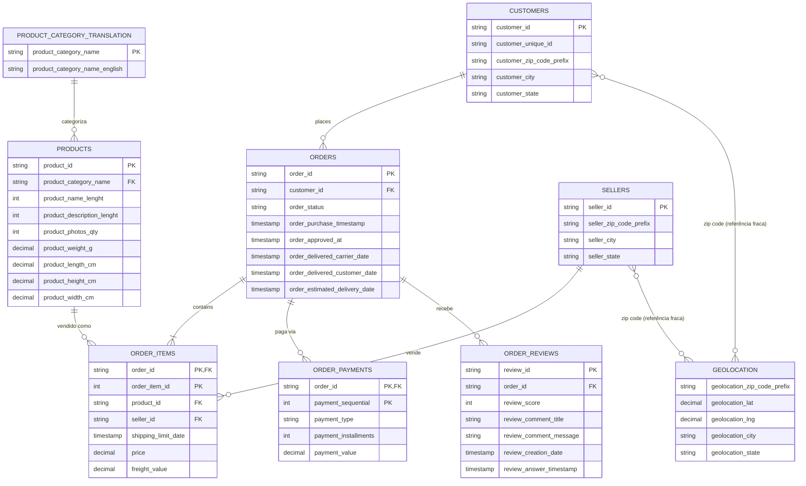

# Diagrama ER — Olist Brazilian E-Commerce Dataset

Gerado a partir da inspeção direta dos cabeçalhos dos CSVs em `data/raw/`.

## Legenda de cardinalidade

| Símbolo | Significado |
|---|---|
| `\|\|--o{` | um-para-muitos (obrigatório do lado "um") |
| `\|\|--\|{` | um-para-muitos (obrigatório em ambos os lados) |
| `}o--o{` | muitos-para-muitos opcional |
| `PK` | chave primária |
| `FK` | chave estrangeira |
| `PK, FK` | chave primária composta que também é estrangeira |

## Observações importantes

- **`customer_id` vs `customer_unique_id`**: cada pedido gera um `customer_id` novo em `orders`/`customers`. Quem identifica a pessoa real ao longo do tempo é `customer_unique_id`. Use `customer_unique_id` para análises de cliente único (ex: recorrência de compra); use `customer_id` para o join técnico com `orders`.
- **`order_items` e `order_payments`** têm chave primária composta (`order_id` + `order_item_id` / `payment_sequential`), porque um pedido pode ter múltiplos itens e múltiplas parcelas/formas de pagamento.
- **`geolocation`** não tem chave primária única (o mesmo `zip_code_prefix` se repete em várias linhas com lat/lng ligeiramente diferentes). O join com `customers`/`sellers` é feito por `zip_code_prefix`, mas é uma relação fraca — vale agregar (ex: média de lat/lng por prefixo) antes de usar.
- **`order_reviews`** é modelado aqui como 1:N em relação a `orders`, mas na prática é quase sempre 1:1 (raríssimos pedidos com mais de uma review).
